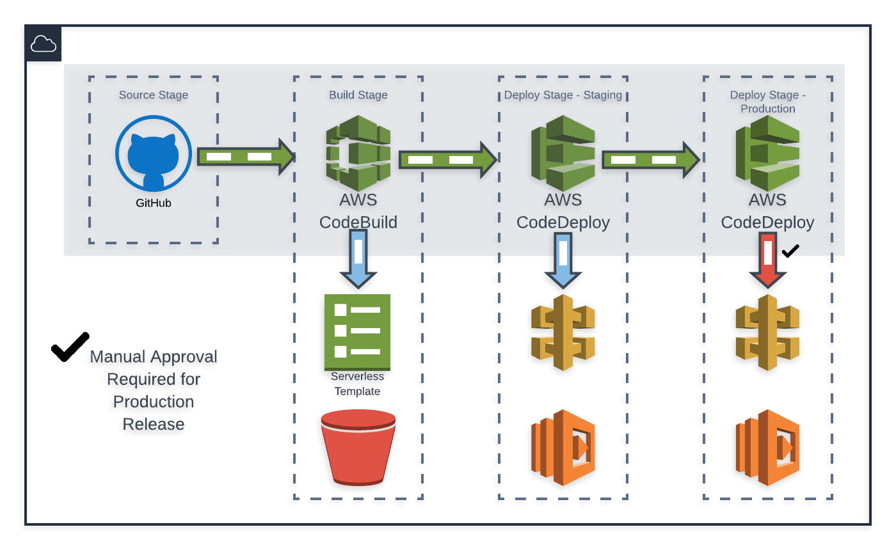

# AWS CDK Serverless CI/CD Pipeline Starter Template
---

This template is meant as a starting guide for building a Serverless CI/CD Pipeline for AWS SAM Applications.

_Note: This is easily adaptable in many ways to other applications. This project assumes you are using AWS SAM for application development, and Github as the source repository._



## Prerequisites
---
- [Installing AWS CLI ](https://docs.aws.amazon.com/cli/latest/userguide/cli-chap-install.html)
- [Configuring AWS CLI](https://docs.aws.amazon.com/cli/latest/userguide/cli-chap-configure.html)
- [Installing AWS CDK](https://docs.aws.amazon.com/cdk/latest/guide/getting_started.html)
- [Configuring AWS CDK]()
- [Generage GitHub OAuth Token](https://docs.aws.amazon.com/codepipeline/latest/userguide/GitHub-create-personal-token-CLI.html)

## Configuring Your Environment
---
This project takes advantage of a `.env` file for managing the CDK Environmental values; Account and Region:
```dotenv
AWS_CDK_DEFAULT_ACCOUNT=123456789012
AWS_CDK_DEFAULT_REGION=us-east-1
```
You will need to create this file in the root of your project and populate it with your relevant information. [PipEnv](https://docs.pipenv.org/en/latest/) will automatically load this file into the shell session, though you are welcome to manage those environment variables as you see fit.

Create a new virtual environment and install dependencies
```bash
pipenv shell && pipenv install
```
If pipenv provides any trouble, you can install directly from the `requirements.txt` using a vanilla Python virtual environment or using PipEnv to install from that file rather than the Pipfile.

## Configuring Parameters
---
Replace the relevant values with your information, and run each of the following commands in your terminal to generate parameters in AWS Parameter Store and a Secret in AWS SecretsManager, which will be used to populate Stack runtime values.

```bash
aws ssm put-parameter \
    --name /serverless-pipeline/sns/notifications/primary-email \
    --description "Email address for primary recipient of Pipeline notifications" \
    --type String \
    --value PRIMARY_EMAIL_ADDRESS

aws ssm put-parameter \
    --name /serverless-pipeline/codepipeline/github/repo \
    --description "Github Repository name for CloudFormation Stack serverless-pipeline" \
    --type String \
    --value GITHUB_REPO_NAME

aws ssm put-parameter \
    --name /serverless-pipeline/codepipeline/github/user \
    --description "Github Username for CloudFormation Stack serverless-pipeline" \
    --type String \
    --value GITHUB_USER

aws secretsmanager create-secret \
    --name /serverless-pipeline/secrets/github/token \
    --secret-string '{"github-token":"YOUR_TOKEN"}'
```

## Provisioning
---
**Note**: Before CDK will automate the creation of a webhook with GitHub, you must manually authorize GitHub as a source for a Pipeline in your AWS Console (Account and Region specific). 
Simply follow the CodePipeline wizard in the AWS Console to the point of authorizing GitHub (OAuth handshake), and once that step is complete you can cancel out of the wizard. 

Run the following AWS CDK command to verify that the environment and pipeline code are valid:
```bash
cdk synth
```
This will output a CloudFormation stack in YAML format to stdout in your shell session.

Run the following AWS CDK command to create the pipeline for your SAM Serverless App:
```bash
cdk deploy
```
This will take a few minutes to complete, but you will see the Stack event stream in stdout. When it's complete you should be able to view the pipeline status in your AWS Console, or by making an API call to retrieve the pipeline state:
```bash
aws codepipeline get-pipeline-state --name go-project-Pipeline --query stageStates[].[stageName,latestExecution.status]
```

## Software Release Process
---
Follow standard Git workflow to deploy code to a Master branch on GitHub. This can be accomplished by pushing directly to Master, _if you like living dangerously_, or through a Pull Request approval/merge on GitHub.

```bash
☠ sam-starter-template ➤ 309674a|master💥
➜ git status
On branch master
Changes not staged for commit:
  (use "git add <file>..." to update what will be committed)
  (use "git checkout -- <file>..." to discard changes in working directory)

	modified:   template.yaml

no changes added to commit (use "git add" and/or "git commit -a")
☠ sam-starter-template ➤ 309674a|master💥
➜ git add .
☠ sam-starter-template ➤ 309674a|master💥
➜ git commit -m 'adds new feature...'
[master 105ba46] adds new feature...
 1 file changed, 1 insertion(+), 1 deletion(-)
☠ sam-starter-template ➤ 105ba46|master💣
➜ git push origin master
Enumerating objects: 11, done.
Counting objects: 100% (11/11), done.
Delta compression using up to 4 threads
Compressing objects: 100% (6/6), done.
Writing objects: 100% (6/6), 564 bytes | 564.00 KiB/s, done.
Total 6 (delta 2), reused 0 (delta 0)
remote: Resolving deltas: 100% (2/2), completed with 2 local objects.
To https://github.com/someuser/sam-starter-template.git
   309674a..105ba46  master -> master
☠ sam-starter-template ➤ 105ba46|master💣
➜
```
The pipeline will now use a webhook with GitHub to pull your source code release and promote it through the pipeline.

## Authors
---
* Scott Schmidt [1Strategy](https://www.1strategy.com)

## License
---
Copyright 2019 1Strategy

Licensed under the Apache License, Version 2.0 (the "License"); you may not use this file except in compliance with the License. You may obtain a copy of the License at

http://www.apache.org/licenses/LICENSE-2.0

Unless required by applicable law or agreed to in writing, software distributed under the License is distributed on an "AS IS" BASIS, WITHOUT WARRANTIES OR CONDITIONS OF ANY KIND, either express or implied. See the License for the specific language governing permissions and limitations under the License.

## References
---
* [AWS CDK Docs](https://docs.aws.amazon.com/cdk/latest/guide/home.html)
* [AWS CDK Construct Library](https://docs.aws.amazon.com/cdk/api/latest/docs/aws-construct-library.html)
* [AWS S3 Developer's Guide](https://docs.aws.amazon.com/AmazonS3/latest/dev/Welcome.html)
* [AWS SAM](https://docs.aws.amazon.com/serverless-application-model/latest/developerguide/what-is-sam.html)
* [AWS CodePipeline](https://docs.aws.amazon.com/codepipeline/latest/userguide/welcome.html)
* [CodePipeline State Changes](https://docs.aws.amazon.com/codepipeline/latest/userguide/detect-state-changes-cloudwatch-events.html)
